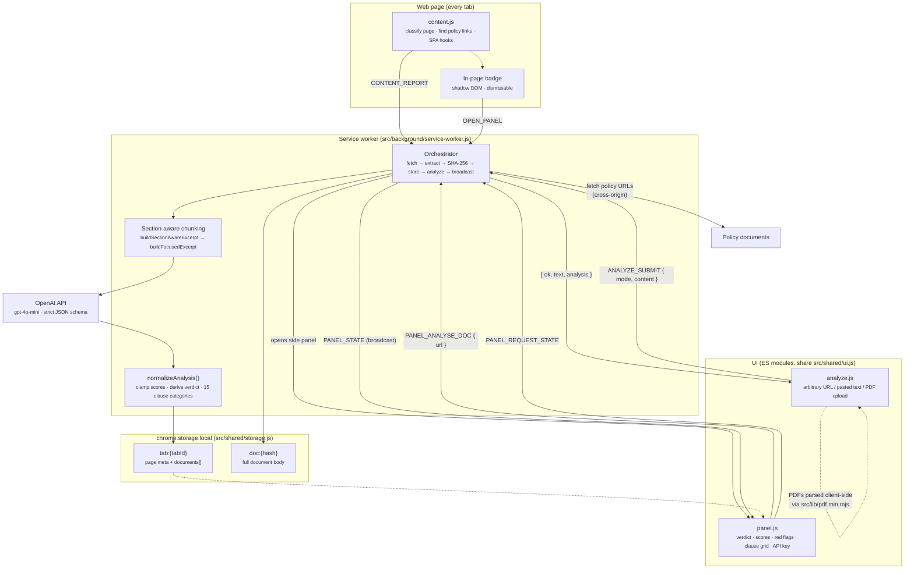
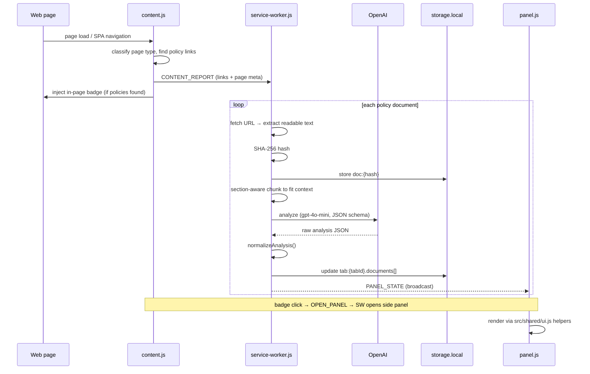

# Architecture

How a page visit becomes an on-screen policy analysis. Message constants live in `src/shared/messages.js`; storage access is centralized in `src/shared/storage.js`.

## Component flow

## Sequence: automatic analysis on page load

## Standalone analyzer (`analyze.js`)

The Analyze tab bypasses the content-script path: it accepts a URL, pasted text, or an uploaded file (PDFs parsed client-side with `pdf.min.mjs`), sends `ANALYZE_SUBMIT` to the service worker, and renders the returned analysis with the same `src/shared/ui.js` helpers as the side panel.
