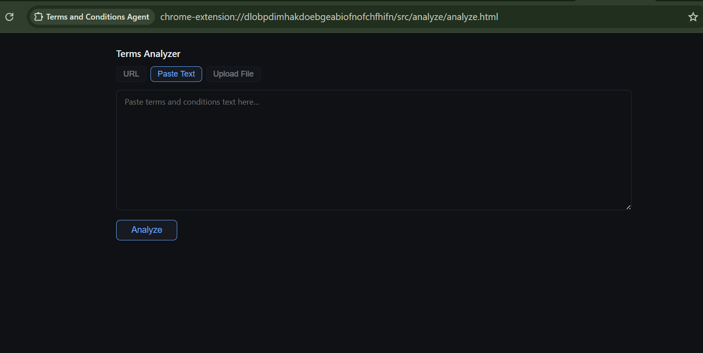
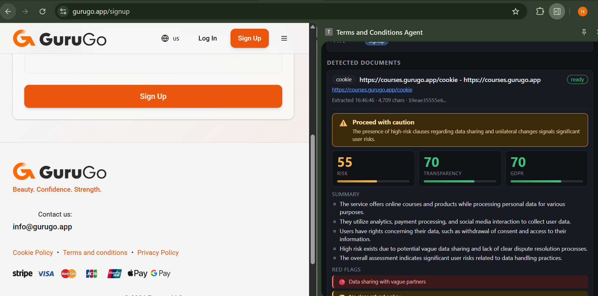

# Terms & Conditions Agent

> **A Chrome / Edge extension that reads the fine print for you — automatically, on every page, before you click Accept.**

`Manifest V3` · `OpenAI gpt-4o-mini` · `No build step` · `Status: Phase 4 shipped, Phase 5 in progress`

The agent runs in the background on every page you visit. When it detects a Terms of Service, privacy policy, cookie notice, or subscription agreement, it fetches the document, extracts the risk-bearing clauses, scores them against a deterministic rubric, and surfaces a plain-English verdict — `safe`, `caution`, or `avoid` — in a side panel. It caches results by SHA-256 content hash, remembers every document you've reviewed, and can draft GDPR rights-request letters for any site.

---

## Contents

- [Demo](#demo)
- [The problem](#the-problem)
- [What it does](#what-it-does)
- [Why this is an agent](#why-this-is-an-agent)
- [How it works](#how-it-works)
- [Quick start](#quick-start)
- [Architecture](#architecture)
- [Comparison vs. existing tools](#comparison-vs-existing-tools)
- [Known limitations](#known-limitations)
- [Roadmap](#roadmap)
- [Privacy](#privacy)

---

## Demo

> Drop PNG screenshots into `docs/` and they will render here. Paths below are placeholders.

**Side panel — live analysis on a signup page**


**Standalone analyzer — paste a URL or raw text**


**Accepted-terms vault — version history per URL**


<details>
<summary>ASCII preview of the side panel (if images haven't been added yet)</summary>

```
┌─────────────────────────────────────────────┐
│  Terms & Conditions Agent     [Analyze] [↺] │
├─────────────────────────────────────────────┤
│  Page   Acme SaaS – Create Account          │
│  Type   [signup]                            │
├─────────────────────────────────────────────┤
│  ▼ Terms of Service           ● Analyzed    │
│    Risk: AVOID 71/100  Transparency: 38     │
│    GDPR: 40/100                             │
│                                             │
│    Red Flags:                               │
│    🔴 Forced arbitration                    │
│       "all disputes shall be resolved by    │
│        binding arbitration in Delaware"     │
│    🔴 Class-action waiver                   │
│    🟡 Perpetual content license             │
│                                             │
│    Before you accept:                       │
│    ✓ Opt out of arbitration within 30 days  │
│      per Section 22.                        │
└─────────────────────────────────────────────┘
```
</details>

---

## The problem

Terms of Service documents are typically thousands of words long and deliberately opaque. They routinely contain clauses that meaningfully harm the person signing — forced arbitration, class-action waivers, auto-renewal traps, perpetual content licenses, data-sale agreements — and they hide behind a single "I agree" checkbox.

Most people never read them. Companies write policies on that assumption.

This extension closes the gap without changing your habits. You keep clicking through signup flows; it reads the document in the background and tells you what you're about to agree to.

---

## What it does

- **Auto-detects** T&C, privacy, cookie, subscription and EULA links on every page and classifies the page context (signup / checkout / account / login).
- **Fetches and extracts** policy text cross-origin from the service worker — bypassing CORS the user would hit.
- **Scores** each document on three axes: `riskScore`, `transparencyScore`, and `gdpr.score`, each 0–100, against a documented deterministic rubric.
- **Surfaces red flags** with severity and the verbatim quote from the policy that triggered each one.
- **Drafts action items** — specific things to do before accepting (e.g. "opt out of arbitration within 30 days per Section 15").
- **Caches** analyses by SHA-256 content hash — the same policy is never analyzed twice.
- **Tracks versions** — detects when a policy you've reviewed changes and preserves the prior version.
- **Generates GDPR rights letters** — access / erasure / portability / objection / cancellation requests, ready to send.

---

## Why this is an agent

It isn't a one-shot prompt. It's a long-running, stateful loop across four capabilities:

| Agent trait | How this project implements it |
|---|---|
| **Observe** | Content script scans the DOM, hooks `pushState` / `replaceState`, and runs a `MutationObserver` to catch SPA navigations and dynamically injected signup modals |
| **Plan** | For each discovered link, decides whether to fetch it, whether the cached analysis is still valid (by content hash), and which risk-dense paragraphs to send the LLM when the doc exceeds 12 KB |
| **Act** | Fetches cross-origin, strips HTML to readable text, calls the OpenAI API with a JSON-Schema–constrained response format, writes structured results to `chrome.storage.local`, broadcasts state to every open panel |
| **Remember** | Hash-keyed document store survives across tabs and restarts; accepted-terms vault keeps version history per URL |

The agent also self-heals: failed extractions are retried on next page scan, analysis errors surface in the UI without blocking the next document, and the OpenAI call falls back from structured-output mode to classic JSON extraction if the endpoint rejects `json_schema`.

---

## How it works

### 1 · Zero-effort detection

The content script (`src/content/content.js`) runs at `document_idle` and classifies the page using real DOM signals, not just URL heuristics:

| Page context | Detection signals |
|---|---|
| Checkout | `input[autocomplete*="cc-"]`, `name*="card"`, `name*="cvv"`, or path/title match `checkout\|pay\|billing` |
| Signup | Two `<input type="password">` (confirm-password), or password + email combo, or path/title match `sign ?up\|register\|create account` |
| Account | Path/title match `subscription\|billing\|my account` |
| Login | Single password field |

Link discovery scans every `<a href>` against 5 regex families covering terms, privacy, cookie, subscription, and EULA patterns — matching on link text, `aria-label`, `title`, and the URL itself.

SPA coverage: `history.pushState` and `history.replaceState` are monkey-patched to trigger a re-scan, and a debounced `MutationObserver` catches DOM-injected signup modals and cookie banners.

### 2 · Cross-origin extraction

The service worker fetches each link with `credentials: "omit"`, then runs a lightweight HTML-to-text extractor that:

- strips `<script>`, `<style>`, `<nav>`, `<footer>`, `<aside>`, `<form>`, and HTML comments
- prefers `<main>` or `<article>` content when present
- preserves paragraph breaks across `<br>`, `</p>`, `</li>`, `</h[1-6]>`, `</div>`, `</section>`
- decodes HTML entities (named + numeric + hex)
- rejects results under 200 chars as soft-404s / empty pages

Each extracted document is SHA-256 hashed and stored under `doc:{hash}`. If the same content is encountered again — same URL another day, or a different URL with identical body — the cached analysis is returned instantly.

### 3 · Focused-excerpt algorithm

When a policy exceeds 12,000 chars (the model context budget), naive truncation would drop the legally significant sections. The agent builds a **focused excerpt** instead:

- **Head — 35%** of budget: intro / scope (sets what the service is)
- **Tail — 15%** of budget: ending (governing law and dispute clauses almost always live here)
- **Bridge — ~50%** of budget: every middle paragraph is scored against 24 risk-indicator regexes (arbitration, waiver, auto-renew, class-action, data sale, indemnification, perpetual license, intellectual property, unilateral change, without notice, etc.) and the highest-density paragraphs are packed into the budget

The model sees the beginning, the end, and the riskiest middle — never a random 12 KB slice.

### 4 · Deterministic scoring rubric

The prompt doesn't ask "is this bad?" It asks the model to apply a numeric rubric with named clause categories.

**Risk score (0–100, capped)** — additive penalties:

| Clause | + |
|---|---|
| Forced arbitration | 25 |
| Class-action waiver | 20 |
| Unilateral ToS changes without notice | 18 |
| Broad IP ownership of user content | 15 |
| Data sale to third parties | 15 |
| Liability cap below actual damages | 12 |
| Auto-renewal without reminder | 10 |
| No-refund policy | 10 |
| Account termination without cause | 8 |
| Vague "partners" data sharing | 8 |

**Verdict** — derived: `avoid` if risk ≥ 70 or any high-severity flag; `caution` if 35–69; `safe` otherwise.

**GDPR completeness (0–100)** — sums applicable points across 6 pillars:

| Pillar | + |
|---|---|
| International transfer safeguards | 20 |
| Data subject rights (access / erasure / portability / object) | 20 |
| Breach notification timeline | 20 |
| Lawful basis for processing | 15 |
| Retention periods specified | 15 |
| DPO or contact named | 10 |

**Transparency score (0–100)** — plain-English vs. obfuscatory legalese, with a concrete example from the text justifying the number.

The response uses OpenAI's **JSON Schema structured output** mode — not prompt-engineered JSON. Every field is typed, required, and validated before rendering; there is no regex parsing of prose. A fallback path handles older endpoints that reject `response_format: json_schema`.

### 5 · Accepted-terms vault & version history

Every document you review is logged locally with its URL, content hash, extraction timestamp, and analysis. When a policy changes — same URL, different hash — the old version is retained so you can see *what* changed since you last accepted.

### 6 · GDPR rights-action generator

For any analyzed site, the agent drafts ready-to-send letters covering:

| Right | Purpose |
|---|---|
| Access | Request a copy of all personal data held about you |
| Erasure | "Right to be forgotten" — full deletion request |
| Portability | Machine-readable export of your data |
| Objection | Stop processing for direct marketing |
| Cancellation | Subscription termination on your terms |

---

## Quick start

**You need:** Chrome 114+ or Edge 114+, and an [OpenAI API key](https://platform.openai.com/api-keys).

```bash
git clone <repo-url>
cd terms-agent-extension

# optional — or paste the key in the side panel's Settings section instead
cp src/shared/config.example.js src/shared/config.js
# edit src/shared/config.js and set OPENAI_API_KEY
```

Then:

1. Open `chrome://extensions` (or `edge://extensions`)
2. Enable **Developer mode**
3. Click **Load unpacked** → select this folder
4. Pin the icon and click it to open the side panel
5. Navigate to any site with a signup flow — results appear in seconds

After code changes: click the refresh icon on the extensions page. Content-script edits also require a tab reload.

---

## Architecture

```
Content Script (runs at document_idle, all_urls)
│  Classifies page type, discovers policy links
│  Re-scans on pushState/replaceState + MutationObserver
│  ── CONTENT_REPORT ──►
│
Service Worker (background, type=module)
│  For each reported link:
│    fetch() ─► extractReadableText() ─► sha256Hex() ─► putDocument()
│    ─► buildFocusedExcerpt() ─► callOpenAI(json_schema)
│    ─► sanitizeAnalysis() ─► putAnalysis()
│  ── PANEL_STATE ──►
│
Side Panel                       Standalone Analyzer
  Listens for PANEL_STATE          Manual URL or paste-text flow
  Renders scores, flags,           Inline red-flag highlighting
  GDPR grid, action items          Same OpenAI pipeline
  Manages API key in Settings
```

```
manifest.json                    # MV3, <all_urls>, sidePanel, scripting, tabs
src/
  background/service-worker.js   # fetch → extract → hash → excerpt → analyze → broadcast
  content/content.js             # IIFE (no ESM); DOM scan + SPA hooks
  panel/panel.{html,js,css}      # side panel UI
  analyze/analyze.{html,js,css}  # standalone analyzer
  shared/
    messages.js                  # CONTENT_REPORT, PANEL_STATE, ANALYZE_SUBMIT, …
    storage.js                   # all chrome.storage.local access
    config.example.js            # API key template (real config.js is gitignored)
  lib/                           # pdf.js (bundled) for PDF policy extraction
```

### Storage schema

| Key | Value |
|---|---|
| `tab:{tabId}` | `{ pageUrl, pageTitle, pageType, observedAt, documents[] }` |
| `doc:{hash}` | `{ hash, url, finalUrl, title, text, textLength, extractedAt }` |

Per-document shape: `{ url, type, status, hash, textLength, extractedAt, analysisStatus, analysis, error? }`

Analysis shape: `{ summary[], redFlags[{text, severity, quote}], gdpr:{score, present[], missing[]}, transparencyScore, transparencyReason, riskScore, verdict, verdictReason, actionItems[] }`

---

## Comparison vs. existing tools

| Feature | This agent | [ToS;DR](https://tosdr.org/) | Typical "TL;DR of ToS" extensions |
|---|:-:|:-:|:-:|
| Works on *any* site, not just curated ones | ✅ | ❌ (human-graded catalog only) | ❌ |
| Analyses the actual document text on demand | ✅ | ❌ | varies |
| Deterministic scoring rubric (not just sentiment) | ✅ | ✅ (human-graded) | ❌ |
| GDPR-specific clause checklist | ✅ | ❌ | ❌ |
| Detects *new* or *updated* policies automatically | ✅ | ❌ | ❌ |
| Generates rights-request letters | ✅ | ❌ | ❌ |
| Runs locally (your key, your data) | ✅ | ✅ (read-only) | varies |

The niche: ToS;DR is accurate but only covers a few hundred sites. Sentiment-based extensions cover every site but produce vague verdicts. This project is an agent that applies a human-style rubric to *any* site, on demand.

---

## Known limitations

Being honest about where the agent's reach ends:

- **Requires your own OpenAI key.** No hosted service; the user pays per-analysis (small — gpt-4o-mini at 12 KB input is cents per document).
- **Login-gated policies can't be fetched** from the service worker context. The standalone analyzer with pasted text is the workaround.
- **PDF support is text-only.** Scanned / image-only PDFs won't extract; pdf.js can only read embedded text layers.
- **English-biased detection.** Link classification regexes are English-language. Non-English sites analyze fine once a link is found, but link discovery may miss them.
- **Model fallibility.** Unusually worded clauses can slip past the rubric. The agent exposes the verbatim quote for each red flag so you can sanity-check the model.
- **No UI for the vault yet.** Phase 3 data is stored; Phase 5 adds the browser UI for reviewing history and diffs.

---

## Roadmap

| Phase | Status | Feature |
|---|---|---|
| 1–2 | ✅ Shipped | Auto-detection, cross-origin extraction, focused-excerpt AI analysis, side panel, standalone analyzer, hash cache |
| 3 | ✅ Shipped | Accepted-terms vault with version history (storage) |
| 4 | ✅ Shipped | GDPR rights-action letter generator |
| 5 | 🔄 In progress | Policy-change reminders, visual diffing, vault review UI |

---

## Privacy

Everything stays on your machine in `chrome.storage.local`. The only outbound network calls are:

- `fetch()` to each policy URL — to read the document
- `POST https://api.openai.com/v1/chat/completions` — to analyze it

Your API key is stored locally only and never transmitted anywhere except directly to OpenAI's endpoint.
